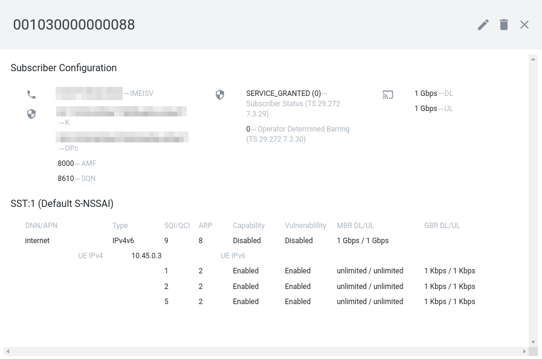

# 1. Prepare QoD TF Docker image
This NEF relies on [Deutsche Telekom CAMARA Transformation Function](https://github.com/camaraproject/QualityOnDemand_PI1), version 0.8.0.
Since the repository does not properly tag the versions we'll checkout to the specific commit.
```bash
git clone https://github.com/camaraproject/QualityOnDemand_PI1.git
cd QualityOnDemand_PI1
git checkout 8cd91562f2e286614d1bc7d3770ccaaaf07f1d1f
```
## 1.1. Adapt config files
Default QualityOnDemand_PI1 config files do not include environment variables. We will adapt them so that they can be easily customized through Docker.

Replace *core/src/main/resources/application.yml* for [this](resources/application.yml). Note that the only changes are in *server.port* and *scef.server.notifications.url*.

Since we are going to deploy the TF in local mode, we also need to update *core/src/main/resources/application-local.yml* for [this](resources/application-local.yml). Note that the only changes are in *scef.server.apiroot* and *qod.availability.url*. 

>If you find the logs very verbose you can also switch *scef.debug* to false, or expose it as an evironment variable.


## 1.2. Build the QoD TF Docker image
Before generating the docker image we have to compile the source code.
From the root of the project, run:
```
mvn clean package
```
This will generate the file *core/target/senf-core-0.8.0.jar* (among others), that we will package into a Docker image.

To avoid issues building the Docker image it is recommended to copy the Dockerfile into the root folder of the project. Then, run:

```bash
docker build -t qod-tf:0.8.0 .
```
# 2 Initial Open5Gs configuration
* **MongoDB reachability**

In the server where the MongoDB is deployed, make sure that it is listening on the right IP address. Check */etc/mongodb.conf* and make sure that *bind_ip* is either 0.0.0.0 or an IP address reachable from the server where the NEF is located. Note down the *port* as well, you'll needed for the NEF MONGODB_URI environment variable. It MongoDB requires authentication, note the credentials down as well.

* **PCF reachability**

Similarly to MongoDB, we also need to make sure that Open5Gs' PCF is reachable from the NEF. Open /etc/open5gs/pcf.yaml and make sure that pcf.sbi.server[0].address is reachable from the NEF. Note down the port number.

* **UE initial configuration**

For all the UEs that we might want to control the priority we need to declare the different QCIs through the Open5GS GUI.The following picture shows an example:



Default QCI is 9, and we manually add QCI 1 (Audio), QCI 2 (Video) and QCI 5 (Control). The MBR and GBR configuration is not important at this point, since the values used will be the ones defined in the NEF. It is important though, to put a value in GBR (ideally small) so the PCC rule gets installed. If left empty (unlimited), the core will fail because it cannot guarantee an unlimited amount of bandwidth.


# 3. Deployment with Docker compose
Assuming you have build the nef docker image as described in the README and the qod-tf image as described in the previous steps, you can deploy the whole system with using Docker compose. Create a compose.yml file with the following template.
```docker
services:
  qod-tf:
    image: qod-tf:0.8.0
    networks:
      - camara
    ports:
      - "9091:9091"
    restart: unless-stopped
    environment:
      NEF_HOST: <NEF_HOST>
      TF_HOST: <TF_HOST>

  nef:
    image: assession-with-qos:0.1.0
    networks:
      - camara
    ports:
      - "8081:8081"
    restart: unless-stopped
    environment:
      NEF_HOST: <NEF_HOST>
      MONGODB_URI: mongodb://<MONGO_IP>:<MONGO_PORT>/naas?authSource=admin
      PCF_BASEPATH: http://<PCF_IP>:<PCF_PORT>/npcf-policyauthorization/v1

networks:
  camara: {}
```
Populate the NEF_HOST and TF_HOST with the IPs or names that refer to the corresponding containers. Since both ports are forwarded to the host you can use a host IP for both environment variables. Also populate MongoDB and PCF IP and port based on the retrieved information from previous steps. Also, if MongoDB requires authentication, append *<MONGODB_USER>:<MONGODB_PASSWORD>@* before <MONGO_IP>.

At this point, everything should be ready. Start the docker containers simply by
```bash
docker compose up -d
```
If everything went fine, you should be able to reach QoD_TF Swagger UI at **http://<HOST_IP>:9091/swagger-ui/index.html**. 

# 4. Testing
Before trying to create a new session it is recommended to leave a background ping from the UE to make sure it is not in idle mode. Then, you may try to follow the [examples](examples.md).